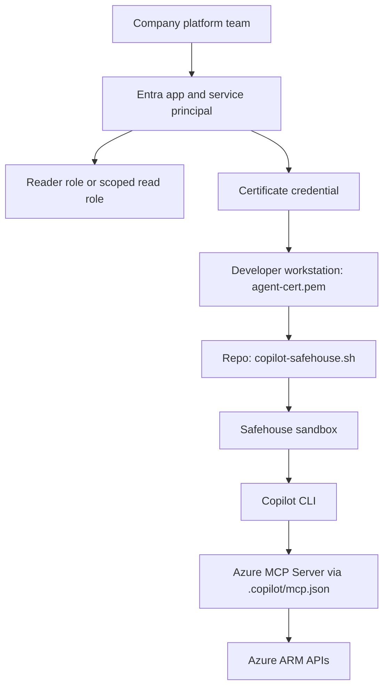

# sandboxed-copilot-cloud-guardrails

> Give your AI coding agent Azure access with guardrails — not the keys to the kingdom.

This repository demonstrates how to give GitHub Copilot CLI scoped, read-only Azure access through a dedicated Entra service principal — never your full user identity. It combines Agent Safehouse for macOS kernel-level sandboxing with certificate-based authentication via the Azure MCP Server.

## What this repo demonstrates

| Aspect | Implementation |
| --- | --- |
| Agent runtime | Copilot CLI |
| Isolation layer | Agent Safehouse (macOS `sandbox-exec`) |
| Cloud auth | Certificate-based Entra service principal |
| Tool surface | Azure MCP Server (`@azure/mcp`) |
| Cloud guardrail | Reader role at subscription scope |

## Architecture

```text
Developer workstation (macOS)
  │
  ├── safehouse/copilot-safehouse.sh
  │     → sources .env.copilot-agent (AZURE_TENANT_ID, CLIENT_ID, CERT_PATH)
  │     → sets AZURE_TOKEN_CREDENTIALS=EnvironmentCredential
  │     → safehouse sandbox-exec with local-overrides.sb
  │       → copilot --dangerously-skip-permissions
  │         → spawns @azure/mcp as MCP child process
  │           → authenticates via EnvironmentCredential (certificate)
  │           → queries ARM API with Reader token
  │           → Reader role denies all mutations
  │
  ├── ~/.config/copilot-agent/agent-cert.pem  (R/O from sandbox)
  │
  └── safehouse/local-overrides.sb
        → deny default (Safehouse built-in)
        → allow: project dir (R/W), ~/.copilot (R/W)
        → allow: cert dir (R/O), ~/.config/gh (R/O)
        → deny: ~/.azure, ~/.ssh, ~/.aws, ~/.gnupg

Azure tenant
  │
  ├── App registration: copilot-sandbox-reader
  ├── Service principal with certificate credential
  └── Role assignment: Reader at subscription scope
```

## Prerequisites

### Core runtime prerequisites

- macOS (Agent Safehouse uses `sandbox-exec`)
- [GitHub Copilot CLI](https://docs.github.com/en/copilot/github-copilot-in-the-cli)
- [Agent Safehouse](https://agent-safehouse.dev) — `brew install eugene1g/safehouse/agent-safehouse`
- Node.js / npx (for the Azure MCP Server)

These are enough to run the company-managed setup, assuming your platform team already provides the Azure identity, certificate, and RBAC assignment.

### Self-provisioned demo prerequisites

- [Terraform](https://developer.hashicorp.com/terraform/install) 1.5+
- Azure CLI (`az`) for Azure login and subscription-scoped role assignment workflows
- An Azure subscription with Owner or Contributor access (for initial role assignment)

These are only required if you want to provision the demo identity from this repo's `terraform/` directory.

### Validation prerequisites

- Azure CLI (`az`)
- `openssl`

The validation script in `scripts/validate.sh` uses Azure CLI to verify service principal login, Reader RBAC assignment, and that write operations are blocked.

## Repository layout

```text
terraform/                  Entra app registration, certificate generation, Reader role (azuread + azurerm + tls)
scripts/                    Validation helper
safehouse/                  Sandbox policy and Copilot CLI wrapper
.copilot/                   Azure MCP Server configuration
.github/copilot/agents/     Custom agent persona for read-only Azure discovery
.github/workflows/          ShellCheck CI
examples/                   Demo prompts and expected outcomes
docs/                       Architecture, threat model, and extension notes
```

## Quick start

### 1. Provision the Entra service principal

```bash
cp terraform/terraform.tfvars.example terraform/terraform.tfvars
# Edit terraform.tfvars: set subscription_id to your Azure subscription
terraform -chdir=terraform init
terraform -chdir=terraform apply
```

This generates a self-signed certificate, creates an Entra app registration and service principal, uploads the public cert, assigns Reader at subscription scope, and writes `~/.config/copilot-agent/agent-cert.pem` and `.env.copilot-agent` to disk.

### 2. Load the shell wrapper

```bash
source safehouse/copilot-safehouse.sh
```

This exports the service principal credentials and defines the `copilot-safe` function. Add it to your `~/.zshrc` for persistent use.

### 3. Launch sandboxed Copilot CLI

```bash
copilot-safe
```

This starts Copilot CLI inside a Safehouse sandbox with the Azure MCP Server configured. The agent can read Azure resources but cannot write, and cannot access sensitive directories on your workstation.

## Using a company-managed Azure identity

If your company already provisions the Azure side, you do not need to copy the full `terraform/` directory or run `terraform apply` from this repo. You can reuse only the local integration pieces, as long as your platform team gives you:

- An existing Entra service principal with the required Azure RBAC role, ideally `Reader`
- The tenant ID and client ID for that service principal
- A certificate PEM file containing the private key, stored locally at `~/.config/copilot-agent/agent-cert.pem` or another path exported as `AZURE_CLIENT_CERTIFICATE_PATH`

In that scenario, the minimum repo-local pieces are:

- `safehouse/copilot-safehouse.sh`
- `safehouse/local-overrides.sb`
- `.copilot/mcp.json`
- Either a `.env.copilot-agent` file or equivalent shell exports for `AZURE_TENANT_ID`, `AZURE_CLIENT_ID`, and `AZURE_CLIENT_CERTIFICATE_PATH`



The important boundary is this: Safehouse only constrains the local runtime. It does not create Azure identity, assign roles, or configure Copilot to start the Azure MCP Server. Those pieces still have to exist already.

The fastest way to adopt this into another repo is:

```bash
./scripts/adopt-company-managed-identity.sh /path/to/your/project <tenant-id> <client-id>
```

This copies `safehouse/` and `.copilot/` into the target project and writes a `.env.copilot-agent` file pointing at `~/.config/copilot-agent/agent-cert.pem` by default.

If your certificate lives elsewhere, pass it explicitly:

```bash
./scripts/adopt-company-managed-identity.sh /path/to/your/project <tenant-id> <client-id> /path/to/agent-cert.pem
```

Then in the target project:

```bash
source safehouse/copilot-safehouse.sh
copilot-safe
```

If you prefer not to use the helper script, you can still copy `safehouse/` and `.copilot/` manually and create `.env.copilot-agent` yourself.

## How it works

Three independent safety layers:

1. **Agent Safehouse** — macOS `sandbox-exec` enforces a deny-first filesystem policy. The agent can only access the project directory, Copilot CLI state, and the certificate. `~/.azure`, `~/.ssh`, `~/.aws` are blocked at the kernel level.

2. **Certificate-based service principal** — The agent authenticates as a dedicated Entra service principal, not as you. `AZURE_TOKEN_CREDENTIALS=EnvironmentCredential` prevents fallback to `az login` or interactive browser auth.

3. **Reader RBAC role** — Azure denies all write operations server-side, regardless of what the agent attempts. The agent persona in `cloud-reader.md` reinforces this at the prompt level.

## Validation

```bash
./scripts/validate.sh
```

Runs six tests: prerequisites, certificate validity, service principal login, Reader role assignment, write-is-blocked, and Safehouse filesystem isolation.

`validate.sh` requires Azure CLI because it performs live Azure checks. It is useful for the self-provisioned demo and optional for company-managed setups.

## Demo walkthroughs

- [Demo 1: List resource groups (read succeeds)](examples/01-list-resource-groups.md)
- [Demo 2: Read VMs and networking](examples/02-read-vms.md)
- [Demo 3: Write blocked (AuthorizationFailed)](examples/03-write-blocked.md)
- [Demo 4: Safehouse blocks sensitive files](examples/04-safehouse-blocks.md)

## Further reading

- [Architecture](docs/architecture.md) — defense-in-depth layers and credential flow
- [Threat model](docs/threat-model.md) — what this protects against, and what it doesn't
- [Local vs. hosted](docs/local-vs-hosted.md) — why local-only for now
- [Extending the pattern](docs/extending.md) — resource group scoping, federated identity, version pinning, Linux alternatives

## Out of scope for v1

- GitHub-hosted Copilot coding agent path (federated identity credentials)
- Write-capable roles for trusted workflows
- Multi-subscription management group scoping
- Linux and Windows support
- Network hostname filtering

These are documented as extension points in [`docs/extending.md`](docs/extending.md).
