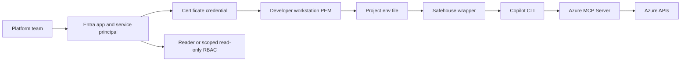

# Architecture

> Defense in depth: four layers between the AI agent and your Azure resources.

## Layers

```text
┌─────────────────────────────────────────────────────────────────────┐
│  Layer 1: Agent Safehouse (macOS sandbox-exec)                      │
│  ┌───────────────────────────────────────────────────────────────┐  │
│  │  Layer 2: Certificate-based service principal                  │  │
│  │  ┌─────────────────────────────────────────────────────────┐  │  │
│  │  │  Layer 3: Reader RBAC role                               │  │  │
│  │  │  ┌───────────────────────────────────────────────────┐  │  │  │
│  │  │  │  Layer 4: Azure MCP Server (controlled tool)      │  │  │  │
│  │  │  │                                                   │  │  │  │
│  │  │  │  Copilot CLI ──> @azure/mcp ──> ARM API           │  │  │  │
│  │  │  └───────────────────────────────────────────────────┘  │  │  │
│  │  └─────────────────────────────────────────────────────────┘  │  │
│  └───────────────────────────────────────────────────────────────┘  │
└─────────────────────────────────────────────────────────────────────┘
```

### Layer 1: Runtime isolation (Agent Safehouse)

Agent Safehouse uses macOS `sandbox-exec` to enforce a deny-first filesystem policy at the kernel level. The sandbox profile:

- **Allows R/W** to the project working directory and `~/.copilot/` (Copilot CLI state)
- **Allows R/O** to `~/.config/copilot-agent/` (certificate), `~/.config/gh/` (GitHub CLI config), and system toolchains
- **Denies** `~/.azure/`, `~/.ssh/`, `~/.aws/`, `~/.gnupg/`, and everything else by default

Syscalls are blocked before file access occurs — the agent sees "Operation not permitted" from the OS, not a soft rejection from the application.

### Layer 2: Certificate-based service principal

Authentication uses a dedicated Entra service principal with certificate credentials instead of the developer's personal Azure identity. The environment variable `AZURE_TOKEN_CREDENTIALS=EnvironmentCredential` restricts the DefaultAzureCredential chain to only check environment variables, preventing fallback to:

- `az login` (developer's personal session)
- Interactive browser login
- Managed identity
- VS Code or Visual Studio credentials

The certificate private key lives at `~/.config/copilot-agent/agent-cert.pem` and is readable only by the certificate owner (chmod 600).

### Layer 3: Reader RBAC role

The service principal is assigned the Azure built-in `Reader` role at subscription scope. This allows:

- `Microsoft.Resources/subscriptions/resourceGroups/read`
- `Microsoft.Compute/virtualMachines/read`
- `Microsoft.Storage/storageAccounts/read`
- All other `*/read` actions across Azure resource types

And denies all write, delete, and action operations. Azure returns `AuthorizationFailed` for any mutation attempt.

### Layer 4: Azure MCP Server (controlled tool surface)

The Azure MCP Server (`@azure/mcp`) provides a structured tool interface for Copilot CLI. Instead of giving the agent raw `az` CLI access (which could be used to run arbitrary commands), the MCP Server exposes discrete, typed operations that Copilot CLI can invoke.

## Credential flow

```text
Shell wrapper (copilot-safehouse.sh)
  │
  ├── exports AZURE_TENANT_ID, AZURE_CLIENT_ID,
  │   AZURE_CLIENT_CERTIFICATE_PATH, AZURE_TOKEN_CREDENTIALS
  │
  └── safehouse → sandbox-exec
        │
        └── copilot --dangerously-skip-permissions
              │
              └── spawns: npx @azure/mcp server start
                    │
                    ├── inherits AZURE_* env vars from parent
                    ├── DefaultAzureCredential → EnvironmentCredential
                    ├── reads certificate PEM file
                    ├── requests token from login.microsoftonline.com
                    └── calls management.azure.com with Reader token
```

## Why Agent Safehouse instead of Docker Sandbox

The previous version of this repo used Docker Desktop's sandbox feature (Linux microVM). Agent Safehouse is preferred for the Azure path because:

- **macOS-native** — no Docker Desktop dependency, simpler install (`brew install`)
- **Kernel-level enforcement** — `sandbox-exec` blocks syscalls before file access
- **Auditable policy** — `.sb` files are human-readable Scheme/S-expressions
- **Simpler architecture** — single `safehouse` command wrapping `copilot`, no container orchestration
- **Faster startup** — no VM boot, instant sandbox creation

## Provisioning

The Azure identity (app registration, service principal, certificate, role assignment) is managed by Terraform in the `terraform/` directory using three providers:

| Provider | Purpose |
| --- | --- |
| `hashicorp/tls` | Generates the RSA private key and self-signed certificate in-memory |
| `hashicorp/azuread` | Creates the Entra app registration, service principal, and certificate credential |
| `hashicorp/azurerm` | Assigns the Reader role at subscription scope |
| `hashicorp/local` | Writes the combined PEM and `.env.copilot-agent` to local disk |

Terraform state holds the RSA private key in plaintext. For anything beyond a personal demo, use encrypted remote state (e.g., Azure Blob Storage with a Customer Managed Key). See `docs/threat-model.md` for details.

## Company-managed provisioning

In some environments, the Azure identity lifecycle is owned by a central platform or security team instead of by the developer's repo. In that model, this repository's `terraform/` directory is optional.

The responsibility split looks like this:

- Platform team: create the Entra app and service principal, upload the certificate credential, and assign `Reader` or another scoped read-only role
- Developer project: carry the local runtime pieces only, namely `safehouse/`, `.copilot/mcp.json`, and `.env.copilot-agent`
- Developer workstation: store the certificate PEM locally and launch Copilot through the Safehouse wrapper

That means Safehouse is not the whole solution by itself. It enforces local filesystem isolation, but it does not provision Azure identity and it does not configure Copilot's Azure MCP integration unless the project also includes `.copilot/mcp.json` and the required `AZURE_*` environment variables.

For teams adopting this pattern into an existing repo, use `scripts/adopt-company-managed-identity.sh` to copy the local integration files and generate `.env.copilot-agent` for a pre-provisioned service principal.



The repo supports both models:

- Self-provisioned demo: use Terraform from this repo
- Company-managed identity: reuse only the local integration pieces

The control boundary is the same in both cases: the agent runs locally inside Safehouse and authenticates with a dedicated service principal constrained by Azure RBAC.

Next steps in the target project:
      1. Confirm the certificate exists at: ${CERT_PATH}
      2. source safehouse/copilot-safehouse.sh
      3. copilot-safe
EOF
